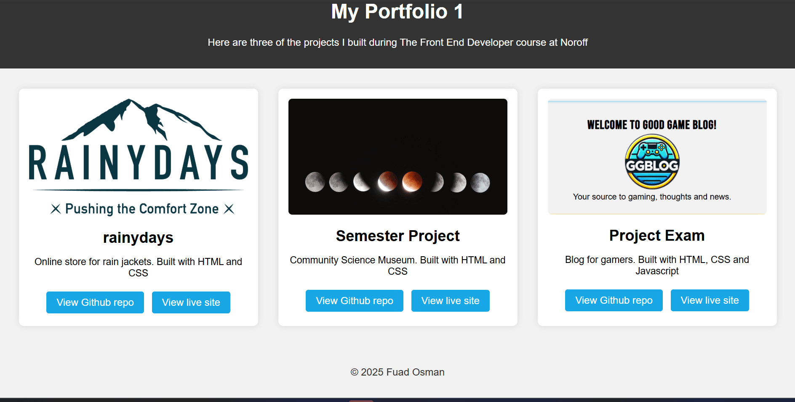

# Portfolio-1

This is a simple portfolio page showcasing three of my projects from the Fron-End Developer course at Noroff.

## Content

- A short description of the three projects:
  - Rainydays - An online store for rain jackets
  - Semester Project 1 - A museum website
  - Project Exam 1 - A community blog for gamers
- Each project has links to the Github repository and a live version

## Built with
- HTML
- CSS
- Javascript

## Live portfolio wesite

## Reflection PDF
